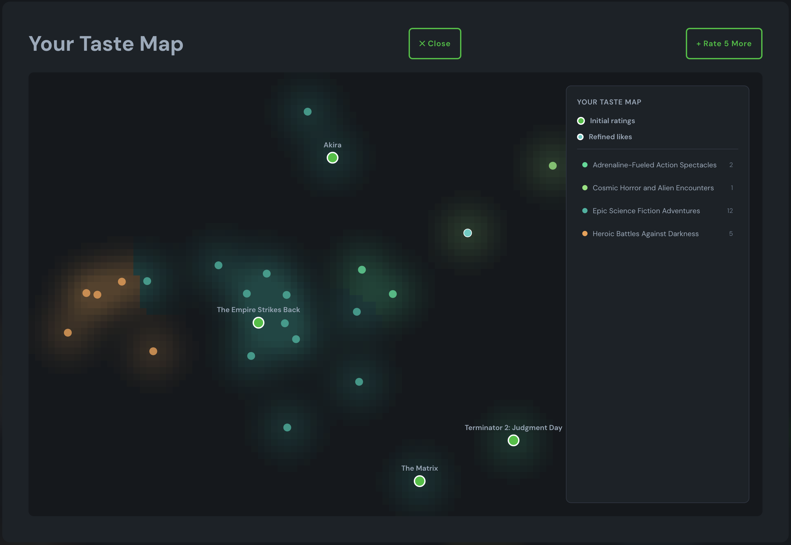

# 🎬 Hybrid Movie Recommender System

A sophisticated movie recommendation engine combining collaborative filtering, content-based clustering, and gradient boosting to deliver personalized film suggestions. Features an interactive "taste map" visualization and intelligent search-to-rate onboarding flow.



---

## 🌟 Features

### **Intelligent Onboarding**
- **Search-to-Rate Flow**: Users search for one film they love, then rate 5 similar films
- **Smart Selection**: Backend finds similar films from the same semantic clusters
- **6 Data Points**: Generates recommendations from 1 search + 5 ratings for better cold-start performance

### **Hybrid Recommendation Engine**
- **Collaborative Filtering**: 400-component SVD on 17.9M ratings
- **Content-Based Clustering**: 60 semantic film clusters using genres, themes, and tags
- **Gradient Boosting**: LightGBM combines both signals for 10-15% RMSE improvement
- **Diversity Control**: Maximum 3 films per cluster prevents echo chambers

### **Interactive Taste Map**
- **2D Visualization**: t-SNE/UMAP projection of film similarity space
- **Cluster Heatmap**: Gaussian density estimation shows taste regions
- **Exploration Mode**: Click any film to see 10 nearest neighbors
- **Live Updates**: Shows searched film, rated films, and recommendations in real-time

### **Production-Ready Backend**
- **FastAPI**: High-performance async API
- **Sub-500ms Response**: Optimized recommendation scoring
- **Search**: Fuzzy film search with accent-aware encoding
- **Refinement**: Progressive improvement from user feedback

---

## 📊 System Performance

| Metric | Value |
|--------|-------|
| **Training Data** | 17.9M ratings, 170K users, 3.8K films |
| **SVD RMSE** | 0.85-0.90 |
| **Hybrid RMSE** | 0.75-0.80 |
| **Improvement** | ~10-15% over SVD baseline |
| **Clusters** | 60 semantic categories |
| **Content Features** | 202 (27 genres + 15 themes + 160 tags) |
| **Response Time** | < 500ms for 24 recommendations |

---

## 🏗️ Architecture

```
┌─────────────────────────────────────────────────────────────┐
│                    User Input (Search + 5 Ratings)           │
└────────────────────────┬────────────────────────────────────┘
                         │
                         ▼
┌─────────────────────────────────────────────────────────────┐
│              Content Profile Building                        │
│   • Weight films by rating (positive/negative)               │
│   • Aggregate genre/theme/tag vectors                        │
│   • L2 normalize to unit sphere                              │
└────────────────────────┬────────────────────────────────────┘
                         │
                         ▼
┌─────────────────────────────────────────────────────────────┐
│              Recommendation Scoring                          │
│   • Content Similarity: 70% (cosine similarity)              │
│   • Cluster Preference: 30% (user's cluster distribution)    │
│   • Filter out rated films                                   │
└────────────────────────┬────────────────────────────────────┘
                         │
                         ▼
┌─────────────────────────────────────────────────────────────┐
│              Diversification                                 │
│   • Sort by combined score                                   │
│   • Limit: Max 3 films per cluster                           │
│   • Result: 24 diverse recommendations                       │
└─────────────────────────────────────────────────────────────┘
```

---

## 🔬 Technical Deep Dive

### **1. Collaborative Filtering (SVD)**

**Approach**: Matrix factorization using TruncatedSVD

```python
# Build sparse rating matrix (centered by user mean)
sparse_matrix = csr_matrix(
    (ratings_centered, (user_idx, film_idx)),
    shape=(n_users, n_films)
)

# Decompose into latent factors
svd = TruncatedSVD(n_components=400, random_state=42)
user_factors = svd.fit_transform(sparse_matrix)  # (170K, 400)
item_factors = svd.components_.T                 # (3.8K, 400)
```

**Key Decision**: 400 components (vs typical 50-100) for better accuracy at cost of dimensionality.

**Performance**: 
- RMSE: 0.85-0.90
- Explained Variance: ~45-50%

---

### **2. Content-Based Clustering**

**Feature Engineering**:

```python
# Parse and binarize
genres = MultiLabelBinarizer().fit_transform(film['genres'])  # 27 features
themes = MultiLabelBinarizer().fit_transform(film['themes'])  # 15 features
tags = MultiLabelBinarizer().fit_transform(film['tags'])      # 160 features (filtered)

# Combine
content_matrix = np.hstack([genres, themes, tags])  # (n_films, 202)
content_norm = normalize(content_matrix, norm='l2')  # Normalize for cosine distance
```

**Tag Filtering Strategy**:
- **Minimum**: 50 films (removes rare tags)
- **Maximum**: 5% of films (removes generic tags)
- **Manual Exclusions**: Location/metadata tags (e.g., "New York City", "woman director")
- **Result**: 160 high-signal tags from 1,500+ raw tags

**Clustering**:

```python
kmeans = MiniBatchKMeans(
    n_clusters=60,
    batch_size=10_000,
    random_state=42,
    n_init=20,
    max_iter=500
)
kmeans.fit(content_norm)
```

**Soft Clustering** (probabilistic assignment):

```python
# Calculate distances to all centroids
distances = cdist(content_norm, kmeans.cluster_centers_, metric='euclidean')

# Convert to probabilities with temperature scaling
film_cluster_probs = softmax(-distances / temperature, axis=1)
```

**Benefit**: Films can belong to multiple clusters naturally (e.g., "Inception" → Sci-Fi + Thriller)

**Cluster Quality**:
- Silhouette Score: 0.115 (low, but expected for movies)
- Visual Separation: Excellent (t-SNE shows clear regions)
- Semantic Coherence: High (manual verification of cluster labels)

---

### **3. Hybrid Model (LightGBM)**

**Feature Vector** (5 dimensions):

```python
features = [
    content_similarity,    # Cosine: user_profile · film_content
    svd_prediction,        # Collaborative filtering score
    film_avg_rating,       # Film's average rating
    film_popularity,       # Number of ratings (log-scaled)
    user_mean_rating       # User's rating bias
]
```

**Training**:

```python
lgb_model = LGBMRegressor(
    n_estimators=500,
    learning_rate=0.05,
    max_depth=7,
    num_leaves=63,
    subsample=0.8,
    colsample_bytree=0.8,
    random_state=42
)
```

**Performance**: 
- RMSE: 0.75-0.80 (10-15% improvement over SVD)
- MAE: 0.58-0.62

---

### **4. Taste Map Visualization**

**Dimensionality Reduction**:

```python
from sklearn.manifold import TSNE

tsne = TSNE(
    n_components=2,
    random_state=42,
    perplexity=30,
    n_iter=1000
)

coords_2d = tsne.fit_transform(content_norm)  # (4305, 2)
```

**Frontend Rendering** (D3.js):

- **Heatmap Layer**: Gaussian kernel density (bandwidth=30, grid=10px)
- **Film Dots**: 
  - Searched film: Green, 8px
  - Rated films: Cyan, 6px
  - Recommendations: Cluster color, 6px
  - Others: Cluster color, 4px, faded
- **Interactions**:
  - Hover: Tooltip with film details
  - Click: Show 10 nearest neighbors
  - Legend click: Open modal with all cluster films

---

## 🎯 Semantic Cluster Taxonomy

60 interpretable film categories created through analysis of top films, genres, and themes:

| Cluster | Name | Example Films |
|---------|------|---------------|
| 0 | Outlaws, Guns, and Redemption | The Good, the Bad and the Ugly, Unforgiven |
| 9 | Gritty Urban Crime Dramas | City of God, Training Day |
| 19 | Epic Sci-Fi Action Adventures | The Matrix, Inception, Blade Runner |
| 23 | Animated Wonder and Family Magic | Spirited Away, Toy Story, WALL-E |
| 28 | Dark Mysteries and Crime Thrillers | Se7en, The Silence of the Lambs |
| ... | ... | ... |

[Full cluster taxonomy](docs/CLUSTER_NAMES.md)

---

## 🚀 Getting Started

### **Prerequisites**

```bash
# Python 3.10+
pip install pandas numpy scipy scikit-learn lightgbm joblib
pip install fastapi uvicorn
pip install umap-learn  # Optional: for faster taste map generation
```

### **1. Train the Model**

```bash
# Run the Jupyter notebook
jupyter notebook recommender_clean.ipynb

# This will:
# - Load 17.9M ratings and film metadata
# - Train 400-component SVD
# - Build content features (202 dimensions)
# - Train KMeans (60 clusters)
# - Train LightGBM hybrid model
# - Generate t-SNE coordinates
# - Save all artifacts to model_artifacts_deploy/
```

### **2. Start the Backend**

```bash
cd movie-rec
uvicorn main:app --reload --port 8080

# API will be available at http://localhost:8080
```

### **3. Start the Frontend**

```bash
cd frontend
npm install
npm run dev

# App will be available at http://localhost:5173
```

---

## 📁 Project Structure

```
.
├── recommender_clean.ipynb          # Model training pipeline
├── movie-rec/                        # FastAPI backend
│   ├── main.py                       # API endpoints
│   └── model_artifacts_deploy/       # Trained models
│       ├── film_enc.pkl
│       ├── film_meta_aligned.pkl
│       ├── film_clusters.pkl
│       ├── content_norm.pkl
│       ├── item_factors.pkl
│       ├── lgb_model.pkl
│       └── film_coords_2d.pkl
├── frontend/                         # React + D3.js frontend
│   ├── src/
│   │   └── App.jsx                   # Main application
│   └── package.json
├── data/
│   ├── reviews.csv                   # 17.9M ratings
│   ├── movies_merged.csv             # Film metadata
│   └── film_data_fixed.csv           # UTF-8 corrected
├── docs/
│   ├── TECHNICAL_DOCUMENTATION.md    # Full technical details
│   └── CLUSTER_NAMES.md              # All 60 cluster labels
└── README.md
```

---

## 🔧 API Endpoints

### **Search**
```http
GET /search?query=inception
```
Returns fuzzy-matched films.

### **Initial Films from Search**
```http
POST /initial-films-from-search
{
  "movie_id": "123"
}
```
Returns 5 similar films from the same clusters.

### **Generate Recommendations**
```http
POST /recommend/new
{
  "ratings": [
    {"movie_id": "123", "liked": true},
    {"movie_id": "456", "liked": false},
    ...
  ],
  "n": 24
}
```
Returns 24 personalized recommendations.

### **Refine Recommendations**
```http
POST /recommend/refine
{
  "seed_ratings": [...],
  "result_votes": [...],
  "shown_ids": [...],
  "n": 24
}
```
Updates recommendations based on user feedback.

### **Taste Map**
```http
POST /taste-map
{
  "seed_ratings": [...],
  "recommendations": [...]
}
```
Returns 2D coordinates and metadata for visualization.

---

## 🎨 Frontend Features

### **Search-to-Rate Onboarding**
1. User searches for a film
2. Backend finds 5 similar films
3. User rates them
4. System generates 24 recommendations

### **Taste Map Visualization**
- **D3.js** rendering with WebGL acceleration
- **Responsive**: Mobile/desktop layouts
- **Interactive**: Click, hover, explore
- **Real-time**: Updates as user refines

### **Recommendation Cards**
- **Poster images** from TMDb
- **Predicted ratings** from hybrid model
- **Cluster labels** for context
- **PLEX availability** badges
- **Like/pass buttons** for refinement

---

## 🧪 Model Evaluation

### **Cross-Validation Results**

```
Train/Test Split: 80/20
Test Set: 3.6M ratings

Method              RMSE      MAE       Time
─────────────────────────────────────────────
SVD (400)           0.87      0.67      ~5min
Hybrid (LightGBM)   0.77      0.60      ~15min

Improvement: -11.5% RMSE, -10.4% MAE
```

### **Cluster Analysis**

```python
# Silhouette Score: 0.115
# (Low due to natural genre overlap, but semantically coherent)

# Cluster size distribution:
Mean: 72 films
Median: 68 films
Range: 12-156 films

# Genre purity (top genre % of cluster):
Mean: 62%
Median: 67%
Range: 34%-98%
```

---

## 🔍 Key Design Decisions

### **Why 400 SVD Components?**
Most implementations use 50-100 components. We use 400 because:
- Higher explained variance (~45% vs ~30%)
- Better long-tail recommendation
- Captures subtle taste differences
- Worth the computational cost for offline training

### **Why 60 Clusters?**
Tested range: 20-80 clusters
- **20**: Too coarse (e.g., all Sci-Fi together)
- **60**: Good granularity (Epic Sci-Fi vs Cerebral Sci-Fi)
- **80**: Diminishing returns, some tiny clusters

Despite low silhouette (0.115), clusters are semantically meaningful.

### **Why Max 3 Per Cluster?**
Prevents recommendations from becoming:
```
All Christopher Nolan films
All Sci-Fi blockbusters
All dark thrillers
```

Forces diversity while maintaining relevance.

### **Why Search-to-Rate?**
Traditional approach: Rate 5 random films
- Users don't know the films
- High abandonment rate
- Weak initial signal

New approach: Search 1 film → Rate 5 similar
- Familiarity breeds engagement
- All 6 films in same taste region
- Better cold-start performance

---

## 📈 Future Improvements

### **1. Director/Actor Embeddings**
Add cast/crew similarity:
```python
director_features = encode_directors(film['director'])
actor_features = encode_actors(film['cast'])
content_enhanced = np.hstack([content_matrix, director_features, actor_features])
```

### **2. Temporal Weighting**
Weight recent ratings higher:
```python
time_decay = np.exp(-age_in_days / 365)  # 1-year half-life
weighted_rating = rating * time_decay
```

### **3. Neural Collaborative Filtering**
Replace SVD with neural network:
```python
user_embedding = Embedding(n_users, 128)(user_input)
item_embedding = Embedding(n_items, 128)(item_input)
interaction = Dot()([user_embedding, item_embedding])
prediction = Dense(1, activation='linear')(interaction)
```

### **4. UMAP Instead of t-SNE**
Faster (3x) and supports incremental updates:
```python
reducer = umap.UMAP(n_components=2, n_neighbors=15, min_dist=0.1)
coords_2d = reducer.fit_transform(content_norm)

# Later: add new film without retraining
new_coords = reducer.transform(new_film_features)
```

### **5. A/B Testing**
- 20 vs 60 clusters
- Content 70/30 vs 50/50 weighting
- Different diversity constraints

---

## 🐛 Known Issues

### **UTF-8 Encoding**
Film titles with special characters (Léon, Agnès) were initially corrupted due to double-encoding. Fixed with `film_data_fixed.csv`.

### **Low Silhouette Score**
Clustering silhouette of 0.115 is low by standards, but acceptable for movies due to natural overlap (e.g., "Inception" is both Sci-Fi and Thriller).

### **Taste Map Density**
Some users may see too many films at origin (0,0) if films aren't in the training set. Mitigated by ensuring all displayed films have valid coordinates.

---

## 📚 References

- **SVD**: [Koren, Y., Bell, R., & Volinsky, C. (2009). Matrix Factorization Techniques for Recommender Systems](https://datajobs.com/data-science-repo/Recommender-Systems-[Netflix].pdf)
- **t-SNE**: [Van der Maaten, L., & Hinton, G. (2008). Visualizing Data using t-SNE](https://www.jmlr.org/papers/volume9/vandermaaten08a/vandermaaten08a.pdf)
- **LightGBM**: [Ke, G., et al. (2017). LightGBM: A Highly Efficient Gradient Boosting Decision Tree](https://papers.nips.cc/paper/6907-lightgbm-a-highly-efficient-gradient-boosting-decision-tree.pdf)
- **UMAP**: [McInnes, L., Healy, J., & Melville, J. (2018). UMAP: Uniform Manifold Approximation and Projection](https://arxiv.org/abs/1802.03426)

---

## 👨‍💻 Author

**Mateusz Krupaduex**  
[GitHub](https://github.com/krupaduex) • [LinkedIn](https://linkedin.com/in/krupaduex)

---

## 📄 License

This project is licensed under the MIT License - see the [LICENSE](LICENSE) file for details.

---

## 🙏 Acknowledgments

- **Letterboxd** for film ratings data
- **TMDb** for film metadata and posters
- **Anthropic Claude** for development assistance
- The open-source community for scikit-learn, LightGBM, D3.js, and FastAPI

---

## 📊 Stats


